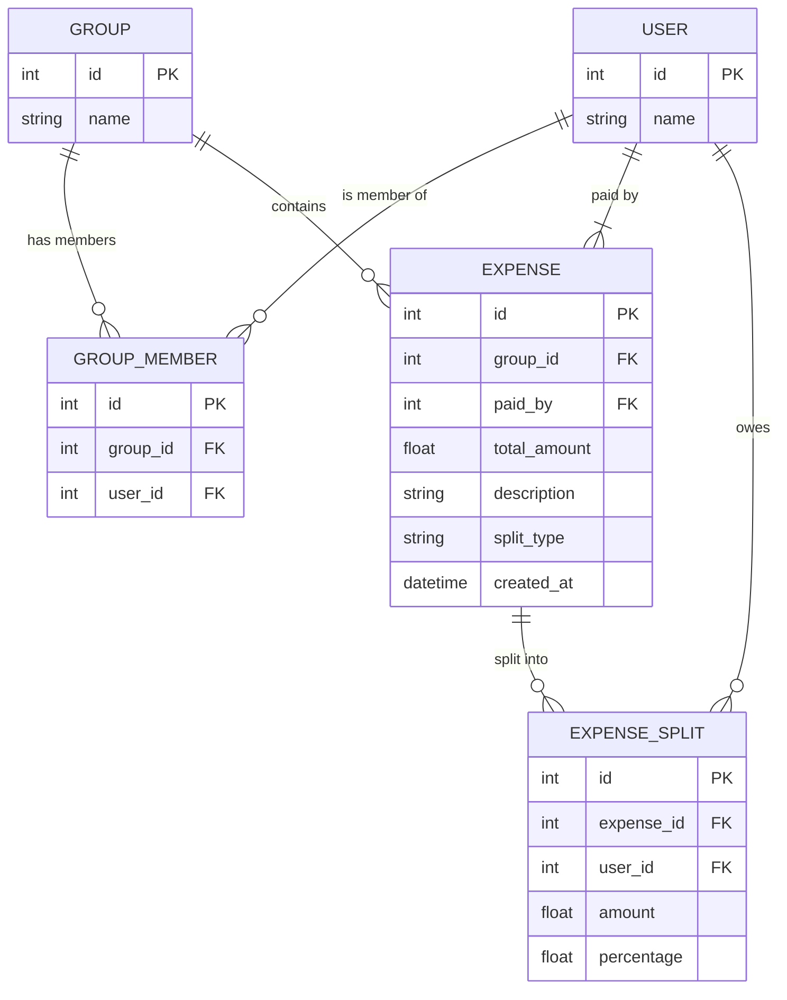

# Splitwise Backend API (Flask Version)

## Overview
This is a simplified backend API inspired by Splitwise. The application allows users to:
- Create users and groups
- Add expenses (using equal or percentage-based splits) to groups
- Retrieve outstanding balances for group members

The API is built using Flask and Flask-SQLAlchemy with SQLite as the database. The entire application is containerized using Docker and can be easily run with docker-compose.

## Tech Stack
- **Flask:** Lightweight web framework for building RESTful APIs
- **Flask-SQLAlchemy:** ORM for database interactions
- **SQLite:** Simple file-based database for local development
- **Docker & docker-compose:** Containerization tools for easy deployment
- **Python 3.8:** Programming language version used

## How to Run the App Using Docker Compose

1. **Prerequisites:**
   - Ensure you have [Docker](https://www.docker.com/) and [docker-compose](https://docs.docker.com/compose/install/) installed

2. **Build and Run:**
   - In the project directory (where the `docker-compose.yml` file is located), run:
     ```bash
     docker-compose up --build
     ```
   - The API will be accessible at [http://localhost:5000](http://localhost:5000)

3. **Stopping the App:**
   - To stop the app, press `Ctrl+C` in the terminal or run:
     ```bash
     docker-compose down
     ```

## ER Diagram
Below is the ER diagram for the application:



## Available Endpoints and Sample Inputs

### 1. Create User
**Endpoint:** `POST /groups/users`  
**Description:** Create a new user.

Sample Input:
```json
{
    "name": "Alice"
}
```

Sample Response:
```json
{
    "id": 1,
    "name": "Alice"
}
```

### 2. Create Group
**Endpoint:** `POST /groups/`  
**Description:** Create a new group with a given name and list of user IDs (members).

Sample Input:
```json
{
    "name": "Trip to Vegas",
    "members": [1, 2, 3]
}
```

Sample Response:
```json
{
    "id": 1,
    "name": "Trip to Vegas"
}
```

### 3. Add Expense (Equal Split)
**Endpoint:** `POST /groups/<group_id>/expenses`  
**Description:** Add an expense to a group. When using an equal split, the total amount is divided equally among all group members.

Sample Input:
```json
{
    "paid_by": 1,
    "total_amount": 300.0,
    "description": "Hotel booking",
    "split_type": "equal"
}
```

Sample Response:
```json
{
    "id": 1,
    "group_id": 1,
    "paid_by": 1,
    "total_amount": 300.0,
    "description": "Hotel booking",
    "split_type": "equal"
}
```

### 4. Add Expense (Percentage Split)
**Endpoint:** `POST /groups/<group_id>/expenses`  
**Description:** Add an expense with a percentage-based split.

Sample Input:
```json
{
    "paid_by": 2,
    "total_amount": 150.0,
    "description": "Dinner",
    "split_type": "percentage",
    "splits": { "1": 40, "2": 30, "3": 30 }
}
```

Sample Response:
```json
{
    "id": 2,
    "group_id": 1,
    "paid_by": 2,
    "total_amount": 150.0,
    "description": "Dinner",
    "split_type": "percentage"
}
```

### 5. Get Group Balances
**Endpoint:** `GET /groups/<group_id>/balances`  
**Description:** Retrieve the outstanding balance for each member in the group. Positive balances indicate that a user is owed money, while negative balances indicate that a user owes money.

Sample Request:
```
GET /groups/1/balances
```

Sample Response:
```json
[
    {
        "user_id": 1,
        "balance": 100.0
    },
    {
        "user_id": 2,
        "balance": -50.0
    },
    {
        "user_id": 3,
        "balance": -50.0
    }
]
```

## Additional Notes

- **Authentication/Authorization:** This version does not implement any authentication or authorization
- **Settlements/Payments:** The functionality for settling balances is not included
- **Assumptions:**
  - All expenses are split among all group members
  - For percentage splits, the sum of the percentages provided must equal 100
